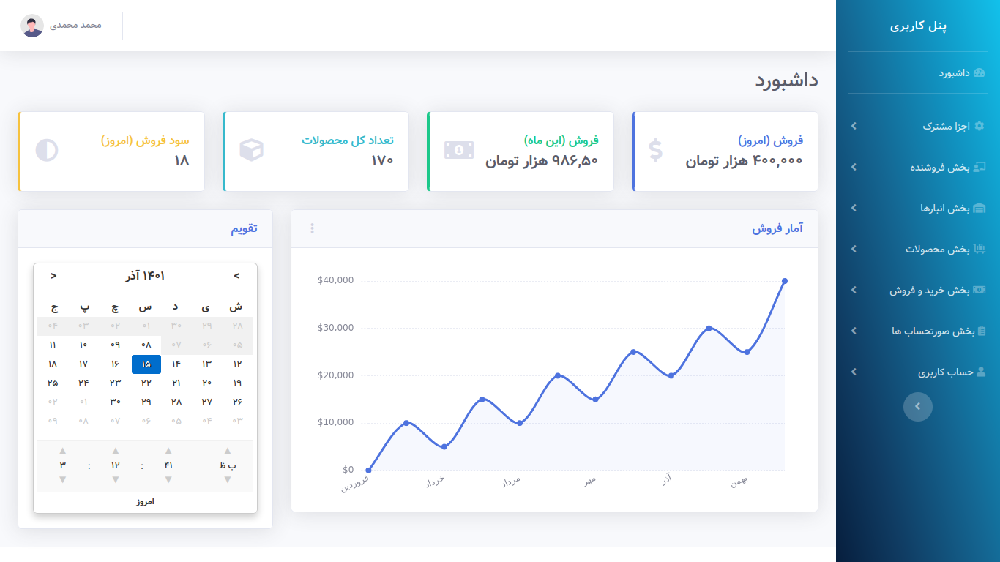

## About StockUnFlock

#### Complete Persian Inventory Management System

An inventory management system (or inventory system) is the process by which you track your goods throughout your entire supply chain, from purchasing to production to end sales. It governs how you approach inventory management for your business.

## What is Inventory Management System

Inventory management software is a software system for tracking inventory levels, orders, sales and deliveries.It can also be used in the manufacturing industry to create a work order, bill of materials and other production-related documents. Companies use inventory management software to avoid product overstock and outages. It is a tool for organizing inventory data that before was generally stored in hard-copy form or in spreadsheets.[wikipedia](https://en.wikipedia.org/wiki/Inventory_management_software)

## Preview


### Dashboard

> ##### powered by [@Laravel](https://laravel.com)
__________________________________________________

## How to run this project

### Prerequisites
You need:

- PHP <= 8.0
- composer
- BCMath PHP Extension
- Ctype PHP Extension
- Fileinfo PHP extension
- JSON PHP Extension
- Mbstring PHP Extension
- OpenSSL PHP Extension
- PDO PHP Extension
- Tokenizer PHP Extension
- XML PHP Extension
- Nodejs 12 or higher (recommended use <= 16)
- NPM 6 or above (recommended use <= 8)

----------------------------

### Setup

> first step clone this project (recommend) or download it, then:

#### setup composer
```
composer install
```

### **copy .env.example file to .env**


#### **generate application key**
```
php artisan key:generate
```

#### **create database and then migrate the tables**
```
php artisan migrate
```

#### **also setup node**
```
npm install
```

#### **then** 
```
npm run dev
```

#### **eventually serve the project**
```
php artisan serve
```
___
### **_Application is ready! enjoy :)_**
